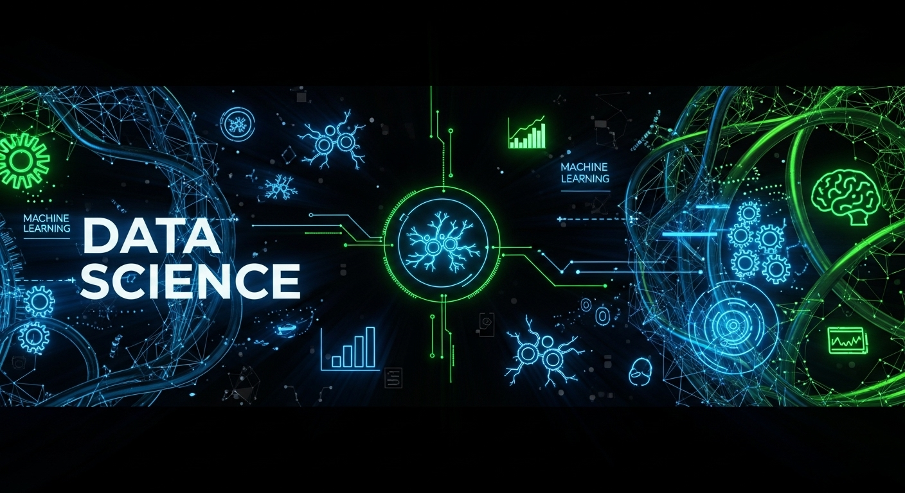

  

  
  
  
  

# Data Science na Prática | AI 

Este repositório foi criado para demonstrar **na prática** como aplico conceitos de **Data Science e Inteligência Artificial** em análises de dados, especialmente voltadas para o **mercado financeiro.**
O objetivo é mostrar meu processo de trabalho, desde a preparação do ambiente até a execução das análises, com foco em **clareza, replicabilidade e resultados aplicáveis.**

---
### 🛠️ Como executo minhas análises

1. **`Definição do problema.`**
* Identifico a questão de negócio ou hipótese a ser testada.
* Exemplo: prever risco de crédito, identificar padrões de consumo ou otimizar processos financeiros.

2. **`Coleta e preparação dos dados`**
* Realizo limpeza e transformação com Python (pandas, numpy).
* Utilizo SQL para extrair dados de bancos relacionais

3. **`Exploração e visualização`**
* Crio gráficos e análises exploratórias para entender o comportamento dos dados.
* Ferramentas: matplotlib, seaborn.

4. **`Modelagem preditiva`**
* Aplico algoritmos de machine learning com TensorFlow e scikit-learn.
* Testo diferentes modelos e avalio métricas de desempenho.

5. **`Interação com LLMs (IA Generativa)`**
* Uso GEMINI, GPT e LangChain  para criar agentes inteligentes que auxiliam na interpretação dos resultados.
* Exploro Gemini para insights estratégicos e análises avançadas.
---

### 🚀 Benefícios
* Demonstração prática de como aplico Data Science em problemas reais
* Uso de ferramentas modernas de IA e Machine Learning
* Foco em mercado financeiro e aplicações estratégicas
* Repositório estruturado para fácil replicação e colaboração
---

👉 **Este projeto mostra como executo minhas análises de ponta a ponta, unindo dados, inteligência artificial e visão de negócios.**

